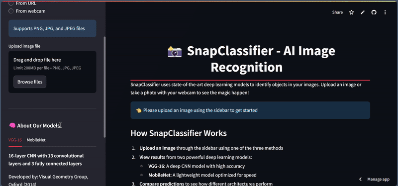

```markdown
# 📸 SnapClassifier

SnapClassifier is a Streamlit-based web application that uses state-of-the-art deep learning models to classify objects in your images. With support for uploading images via file, URL, or webcam, SnapClassifier provides instant predictions using two powerful architectures: VGG-16 and MobileNet.

---

## 🔗 Live Demo
Experience SnapClassifier live at: [https://parmindersinghgithub-snapclassifier-main-0wlfjk.streamlit.app/](https://parmindersinghgithub-snapclassifier-main-0wlfjk.streamlit.app/)

## 🎬 GIF Demo


---

## 🚀 Features

- **Multiple Upload Options**: Upload images from your computer, via URL, or directly through your webcam.
- **Dual-Model Predictions**: Compare results from VGG-16 and MobileNet side by side.
- **Test-Time Augmentation**: Boost confidence by averaging predictions over multiple crops.
- **Image Enhancement**: Automatic contrast and sharpness enhancement before prediction.
- **Clean UI**: Responsive design with custom CSS for a modern look.
- **Detailed Output**: View top-5 predictions with probabilities.

---

## 📥 Installation & Setup

1. **Clone the repository**

   ```bash
   git clone https://github.com/ParminderSinghGithub/SnapClassifier.git
   cd SnapClassifier
   ```

2. **Create a virtual environment (optional but recommended)**

   ```bash
   python3 -m venv venv
   source venv/bin/activate   # On Windows: venv\Scripts\activate
   ```

3. **Install dependencies**

   ```bash
   pip install -r requirements.txt
   ```

4. **Run the app**

   ```bash
   streamlit run main.py
   ```

5. **Open in browser**

   Navigate to `http://localhost:8501` to start using SnapClassifier.

---

## 🛠️ How It Works

1. **Image Upload**: User uploads an image (file, URL, or webcam).
2. **Preprocessing**: The image is converted to a NumPy array, enhanced (contrast & sharpness), resized to 224×224, and preprocessed according to the chosen model.
3. **Prediction**: Two predictions are made (VGG-16 & MobileNet), each using test-time augmentation (original + two minor crops).
4. **Aggregation**: Predictions are averaged to provide robust confidence scores.
5. **Display Results**: Top-5 labels and probabilities are shown side by side for comparison.

---

## 🧠 Model Architectures

### VGG-16
- **Architecture**: 16-layer CNN (13 convolutional + 3 FC layers)
- **Parameters**: 138 million
- **Developed by**: Visual Geometry Group, University of Oxford (2014)
- **Top-5 Accuracy**: 92.7% on ImageNet
- **Characteristics**: Simple yet deep; uses only 3×3 convolutions stacked sequentially.

### MobileNet
- **Architecture**: Depthwise separable convolutions with 28 layers
- **Parameters**: 4.2 million
- **Developed by**: Google (2017)
- **Top-5 Accuracy**: 89.5% on ImageNet
- **Characteristics**: Lightweight; optimized for mobile and embedded devices.

---

## 👩‍💻 Tech Stack

- **Frontend**: [Streamlit](https://streamlit.io/)
- **Backend & Models**: [TensorFlow](https://www.tensorflow.org/) & [Keras](https://keras.io/)
- **Image Processing**: [Pillow](https://python-pillow.org/)
- **Data Handling**: [NumPy](https://numpy.org/), [Pandas](https://pandas.pydata.org/)

---

## 📜 License

This project is licensed under the MIT License. See the [LICENSE](LICENSE) file for details.

---
